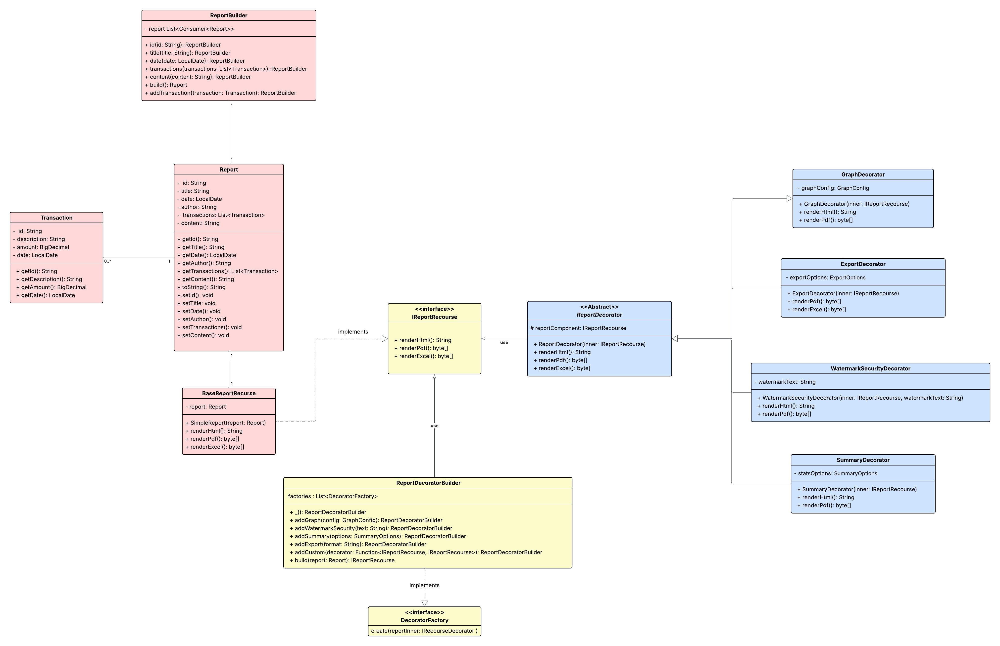

# TallerEvaluativo_DOSW-1
Taller evaluativo de sistema de reportes financieros

**Integrantes:**
- Juan Pablo Caballero Castellanos.
- Oscar Sanchez Porras.
- Robinson Steven Nuñez.
- David Santiago Palacios.
- Diego Fernando Chavarro.

**Nombre De la Rama:**

`develop`

---

## Diagramas UML

### *Diagrama de Clases:*

---

#### **Principios SOLID**

###### *Single Responsibility Principle:*

Cada clase se encarga de un unica cosa y esto se ve reflejado en:

ReportBuillder ya que se encarga de construir el reporte y con BaseReportRecourse generamos la representación de ese reporte.

La Transaction se encarga de los movimientos de los datos del reporte.

Las clases que extienden de ReportDecorator se encargan de diferentes de reportes pero todas hacen algo diferente.

###### *Open/Closed Principle:*

Con la interfaz IReportRecourse y la clase abstracta ReportDecorator nos permiten crear nuevas subclases y que a su vez estas puedan
definir su propio comportamiento, gracias a esta abstracción, cada decorador puede sobreescribir únicamente lo que necesita y 
asi podemos añadir funcionalidades de los gráficos, marcas de agua y resumenes. 

###### *Interface Segregation Principle:*

Se diseñaron interfaces concretas y con pocos metodos para establecer contratos para los recursos
como IReportRecourse y DecoratorFactory.

###### *Dependency Inversion Principle*

ReportDecoratorBuilder es un modulo de alto nivel por lo que no estamos dependiendo de los modulos de bajo nivel ya que
define el flujo usando IReportRecourse y implementando DecoratorFactory asi el builder trabaja con abstracciones no con clases concretas.

El builder orquesta la composicion usando unicamente estas abstracciones y que decoradores aplicar y en que orden pero no como estan implementados