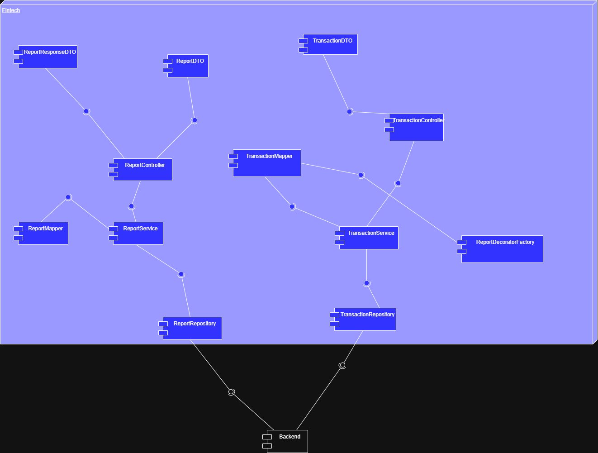
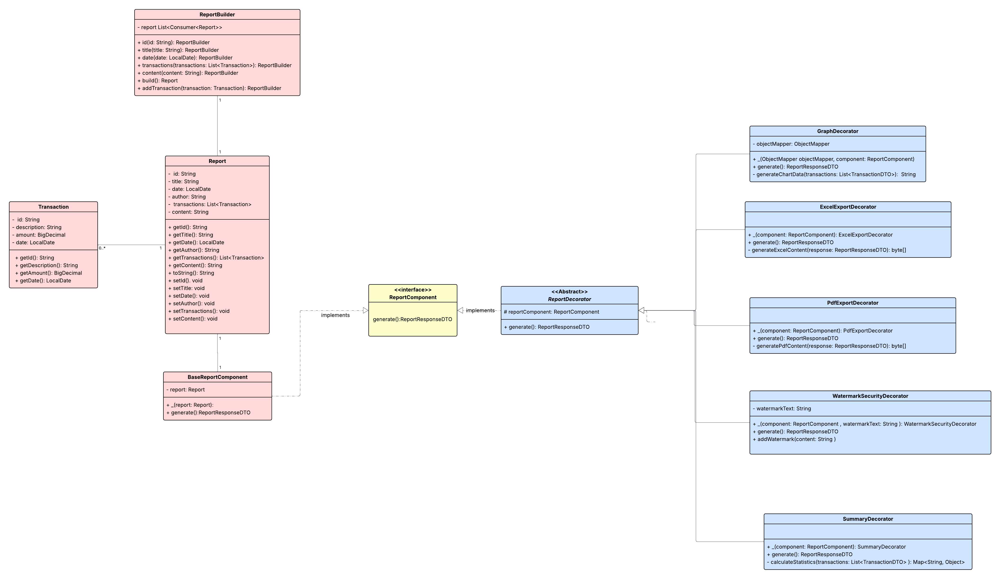
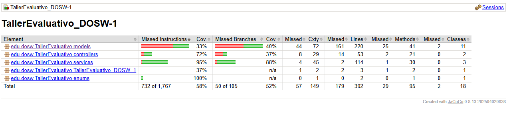
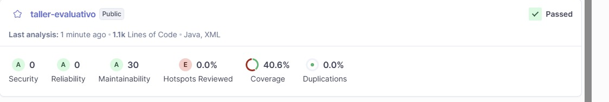

# TallerEvaluativo_DOSW-1
Taller evaluativo de sistema de reportes financieros

**Integrantes:**
- Juan Pablo Caballero Castellanos.
- Oscar Sanchez Porras.
- Robinson Steven Nuñez.
- David Santiago Palacios.
- Diego Fernando Chavarro.

**Nombre De la Rama:**

`develop`

---

## Diagramas UML

### *Diagrama de Componentes Especifico:*

La arquitectura del sistema se organiza en diferentes componentes.  
Los DTOs son los encargados de enviar las solicitudes hacia los controladores. Por ejemplo:

- ReportResponseDTO y ReportDTO se comunican con el ReportController.
- TransactionDTO se comunica con el TransactionController.

A su vez, los controladores delegan la lógica de negocio a los servicios correspondientes:

- ReportController interactúa con el ReportService.
- TransactionController interactúa con el TransactionService.

Los servicios utilizan mapeadores para transformar los datos entre los distintos DTOs y las entidades del dominio:

- ReportService se apoya en el ReportMapper.
- TransactionService se apoya en el TransactionMapper.

Posteriormente, los servicios hacen uso de los repositorios ReportRepository y TransactionRepository para realizar operaciones de persistencia, ya sea consultas o almacenamiento de información en el backend.

Finalmente, en el caso de los reportes, el ReportService se integra con la ReportDecoratorFactory, lo que permite extender dinámicamente las funcionalidades de los reportes antes de almacenarlos o presentarlos.

### *Diagrama de Clases:*

---

#### **Principios SOLID**

###### *Single Responsibility Principle:*

Cada clase se encarga de un unica cosa y esto se ve reflejado en:

ReportBuillder ya que se encarga de construir el reporte y con BaseReportComponent generamos la representación de ese reporte.

La Transaction se encarga de los movimientos de los datos del reporte.

Las clases que extienden de ReportDecorator se encargan de diferentes de reportes pero todas hacen algo diferente.

###### *Open/Closed Principle:*

Con la interfaz ReportComponent y la clase abstracta ReportDecorator nos permiten crear nuevas subclases y que a su vez estas puedan
definir su propio comportamiento, gracias a esta abstracción, cada decorador puede sobreescribir únicamente lo que necesita y 
asi podemos añadir funcionalidades de los gráficos, marcas de agua y resumenes. 

###### *Interface Segregation Principle:*

Se diseño una interfaz concreta y con pocos metodos para establecer contratos para los recursos con 
ReportComponent  

###### *Dependency Inversion Principle*

ReportDecorator es un modulo de alto nivel por lo que no estamos dependiendo de los modulos de bajo nivel ya que
define el flujo usando IReportRecourse y implementando ReportComponent asi el builder trabaja con abstracciones no con clases concretas.

El builder orquesta la composicion usando unicamente estas abstracciones y que decoradores aplicar y en que orden pero no como estan implementados

---
=======

## Prueba endpoints de trannsacciones

- Prueba de crear una transacción. 

[alt text](docs/videos/PruebaCreaciónTransacción-Swagger.mp4)

- Prueba consultar una transacción por el monto dado.

[alt text](docs/videos/PruebaConsultarTransacciónMonto-Swagger.mp4)

- Prueba Consultar una transacción por su fecha.

[alt text](docs/videos/PruebaConsultarTransacciónFecha-Swagger.mp4)

- Prueba consultar todas las transacciones que existen.

[alt text](docs/videos/PruebaConsultarTodasTransacciones-Swagger.mp4)

- Prueba consultar transacciones por su id.

[alt text](docs/videos/PruebaConsultarTransaccionesId-Swagger.mp4)

- Prueba actualizar transacciones por id.

[alt text](docs/videos/PruebaActulizarTransacción-Swagger.mp4)

- Prueba para eliminar transacciones existentes.

[alt text](docs/videos/PruebaEliminarTransacción-Swagger.mp4)

## para reports:
- GET/reports/{id}
- PUT/reports/{id}
- DELETE/reports/{id}
[alt text](docs/videos/reports1.mkv)

- GET/reports
-POST/reports
-POST/reports/{id}/export
-POST reports/{id}/decorated
-GET reports/{id}/statics
-GET reports/{id}/charts
-GET reports/by-date
-GET reports/by-author
[alt text](docs/videos/reports2.mkv)

---
### Cobertura
**jacoco**

**sonarqube**

